# Welcome to the Awesome 80s Drum Machine!
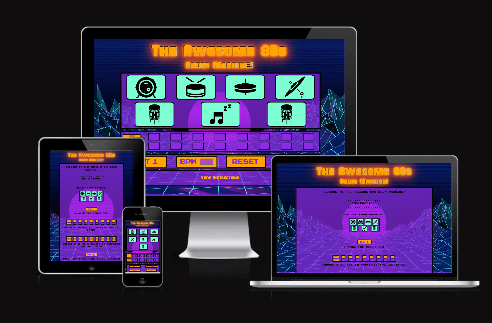
 

[View the live site here](https://nickwaldock.github.io/Awesome-80s/)
 
 

# Table of Contents
1. [Introduction](#introduction)
    1. [Aims](#aims)
2. [User Experience](#user-experience-ux)
    1. [User Stories](#user-stories)
3. [Main Features](#main-features)
    1. [Inspiration & Design](#inspiration--design)
    2. [Colours & Typography](#colours--typography)
    3. [Fonts](#fonts)
    4. [Wireframes](#wireframes)
    5. [Features](#features)
    6. [User Interactivity](#user-interactivity)
    6. [Future Developments](#future-developments)
4. [Technologies](#technologies)
5. [Testing](#testing)
    1. [Code Validation](#code-validation)
    2. [Lighthouse Score](#lighthouse-score)
    3. [Tools](#tools)
    4. [Browser Compatibility](#browser-compatibility)
    5. [Device Compatibility](#device-compatibility)
6. [Deployment](#deployment)
    1. [GitHub](#github)
    2. [Forking](#forking)
    3. [Cloning](#cloning)
7. [References & Acknowledgements](#references--acknowledgements)
   1. [Icons](#icons)
   2. [Audio](#audio)
   3. [References](#references)
   4. [Acknoledgements](#acknoledgements)
 
 

# Introduction & Aims
The 'Awesome 80s Drum Machine!' is an 80s inspired interactive music making platorm. This site is a fun and engaging throwback to the music of the 80s and the sounds that defined a generation of music. 
This site was created to utilise the language of JavaScript and demonstrate user interactivity in a musical context. During this site the user is able to mix and match numerous drum sounds to create unique drum grooves at different speeds. This project represents my second major project with Code Institute.
 
 
This site is for educational and entertainment purposes only.

## Aims
- To create a site with a HTML structure, CSS styling, and JavaScript interactivity
- To utilise functional and simple design concepts for an easy-to-navigate UX
- Responsive design for accessability on all devices
- Incorporate audio manipulation in an interactive context
- Be visually striking
- Simple to follow instructions
- Be fun and engaging!
 
 

# User Experience
## User Stories
### As a first time visitor, I want to:
- Be able to easily comprehend the instructions for the game, know how to interact with the site and easily find the interactive elements
- Be able to view the instructions again after commencing the game if required
- Be able to change the speed of the playback
 
 

### As a returning visitor, I want to:
- Be able to explore the range of sounds and combinations of user choices
- Enjoy making music!
- Be able to play the game on different devices
 
 
 

# Main Features
## Inspiration & Design
The site was inspired by the western pop culture of the 1980s and contains features of the decade such as early arcade style typograpy, bright neon contrasting colors, bold and simple layouts and borders, and a retro-futuristic background.
 
 

## Colours & Typography
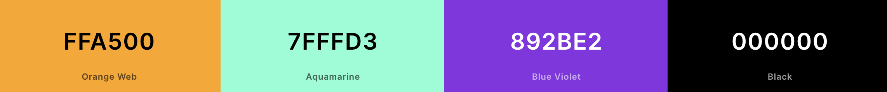
 
 
The colours used in this project include standard Orange (#ffa500) for the button backgrounds and title text, Aquamarine (#7fffd3) for the drum trigger backgrounds, Blue Violet (#892be2) for div backgrounds, and black (#000000) for borders and arcade text. These choices were inspired by the 80s style design and add the bright, contrasting 'pop' typical of designs from the decade.
 
 

## Fonts
### Main Title Font
https://www.dafont.com/hauser.font
 
 
The font Hauser was chosen as an 80s style title font typical of arcade games and poster images of the era.
 
 

### Arcade Font
https://www.dafont.com/arcade-classic-2.font
 
 
The font Arcade font was chosen as an 80s style text font typical of arcade games of the era and to add to the sense of a digital retro experience.
 
 

## Wireframes
[Balsamiq](https://balsamiq.cloud/) has been used to develop wireframes to demonstrate the basic design of the site.
 
 
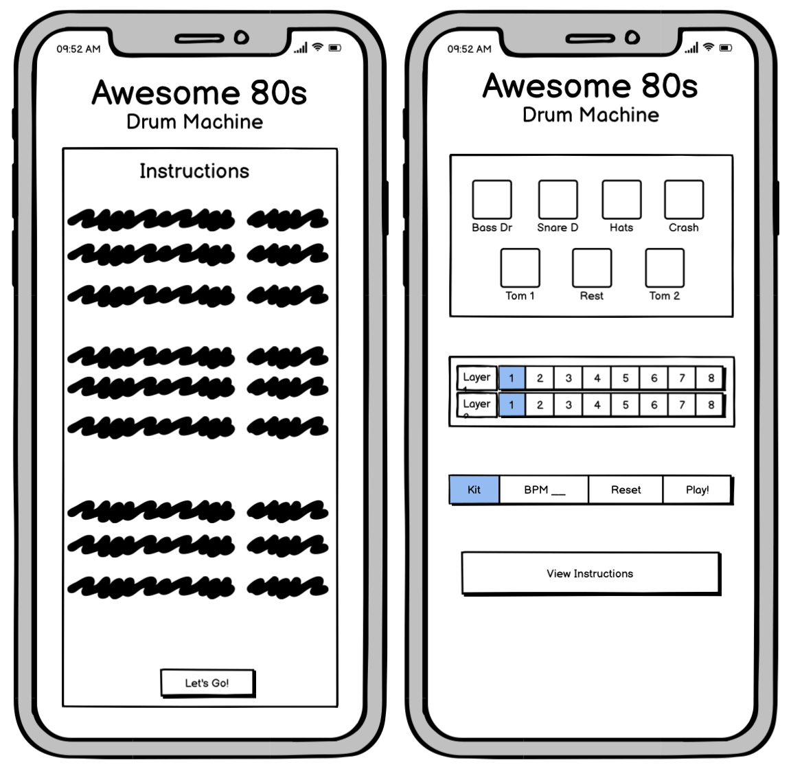
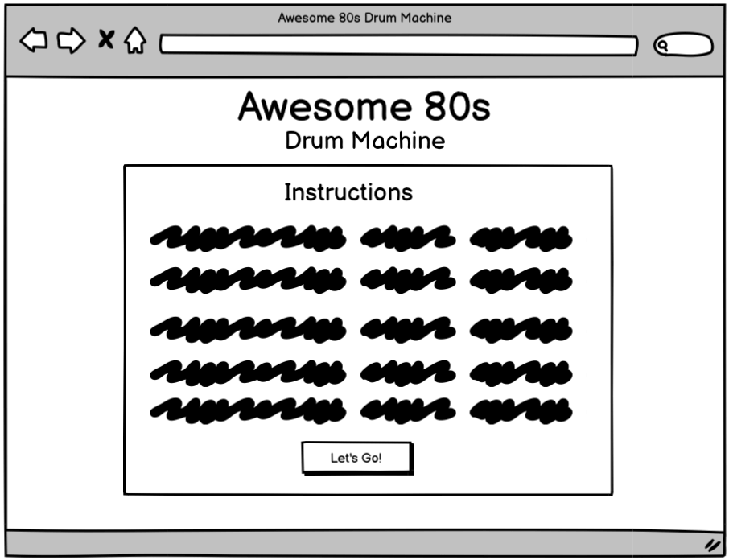
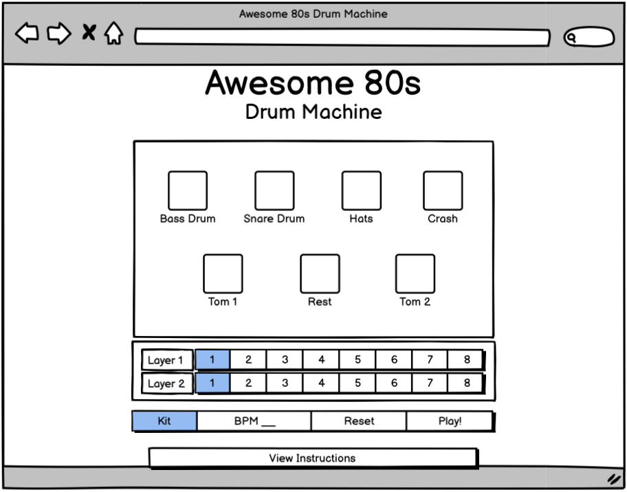
 
 

## Features
- An introductory screen with consise and easy to follow instructions on how the game works
- A 'Let's Go!' button to transition to the game area
- 3 distinct areas for the game elements: The clickable icons, the layer indicators, and the control buttons
- Large icons as clickable elements that play the associated sounds on click
-  Layer indicatiors that light up and visually show the number of choices made (to a max of 16) when a user input is chosen.
- Control buttons: 
    - Kit - to change the sound set; 
    - BPM - to chose the speed to playback
    - Reset - to reset the users choices
    - Play! - to play the chosen samples
    - Stop - to stop playing the audio
 
 

## User Interactivity
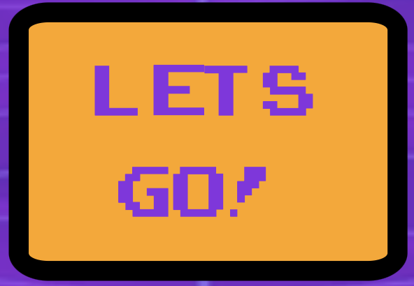
The "let's Go!" button is the first interactive element on the page and is available at the bottom of the instructions that show on page load. The intention is that the user will need to read the instructions to understand the basic mechanics of the site before beginning. CLicking this button transitions the user to the main game area.
 
 

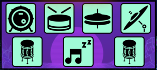
The user then sees the above icons at the top of the page which represent the different sound 'tiggers'. Clicking one of these representational icons will play the audio sample attached to it once and add that sound to the machine's memory. Each icon contains a different drum kit sound: (from top left to right)Bass Drum, Snare Drum, Hi-Hats, Crash Cymbal, (botton left to right) Tom 1, Rest, and Tom 2. The rest symbol allows the user to program silence into their rhythm and is included to give the user a more musical experience.
 
 

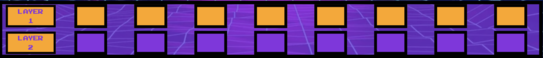
Below the drum trigger icons the user will see two rows of squares called "Layer 1" and "Layer 2". These represent the programmed sounds generated from the users input (from clicking the drum trigger icons). With each sound selection one square will change color to indicate it has been saved. Sounds are saved in the order they are clicked. Once the user has selected 8 sounds the second layer is automatically filled. Each layer has a maximum size of 8 sounds to correspond with the 4, 8 (16, 32, etc) division of beats usually found in popular music. Once both layers are filled with 8 sounds the user can still click to hear the sounds individually but they will not be saved.
 
 

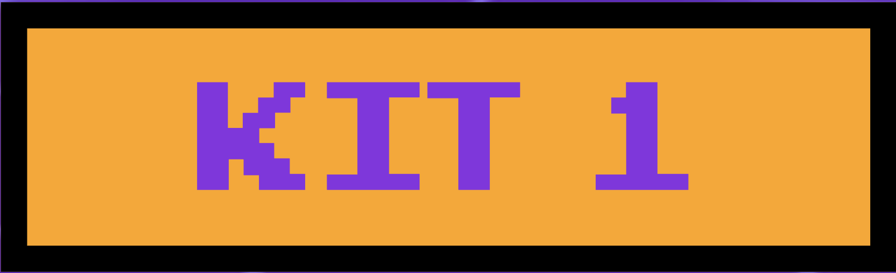
The "Kit" button switches between one set of drum sounds to another contrasting set of drum sounds. By default the button states "Kit 1" indicating that the default sound set is loaded. On clicking of this button the value changes to "Kit 2" and indicated that the second sound set is loaded. When the user then chooses sounds from the drum icons they will hear the alternative sound set. These sounds can and will be loaded into the machine when clicked and can be mixed with the sounds from Kit 1 in the same sequence meaning the user has access to program 12 individual drumkit sounds (and a rest for silence) within 16 beats making for an exceptionally large number of combination possibilites. 
 
 

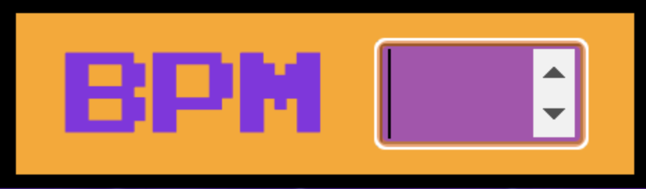
The "BPM" input box is available for the user to input a speed (Beats Per Minute) into the machine thereby choosing how fast the selected sounds will play back. The speed is inuptted as a BPM integer and converted to milliseconds in JavaScript for the computer to comprehend. 
* note: if the user chooses a slow BPM speed (< 80bpm) the user will notice a small delay from clicking the "Play" button and the sound commencing, this is due to the speed interval between existing at the start of the loop before the sound is played. This is less noticable at faster speeds.

 
 

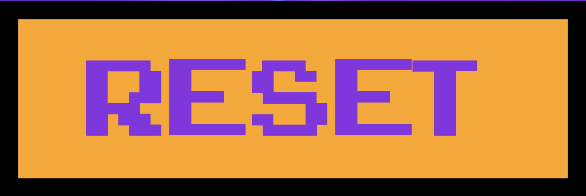
The "Reset" button allows the user to clear (delete) both layers of any previously programmed sound allowing them to generate a new pattern of sounds for playback. 

 
 

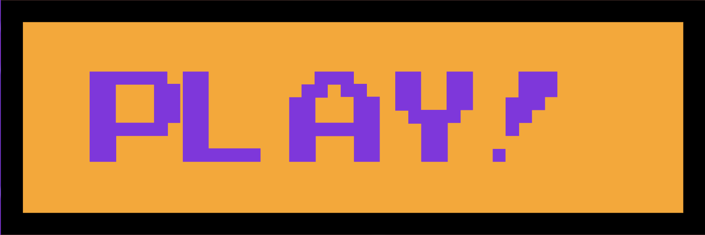

 
 

## Future Developments
- Main Volume control - for the user to quickly and easily control output volume
- Loop function - for the user to be able to play the loop continuously and stop the audio at will
- Additional drum sound sets
- Additional 80s instruments - synthesizers, bass, keyboards, guitars
- Additional programmable layers 
- Play-a-long feature - pre-loaded song audio (minus drums) to 'jam' along with
- Keyboard input function
- Have the loop commence from the first sound and not the inputted bpm interval for a smoother and more responsive experience
 
 

# Technologies
Languages used in this site are HTML 5, CSS3 and JavaScript.

Additional technologies include: 
- [EZ Gif](https://ezgif.com/) 
   -for image file-type modification to webp
- [TinyPNG](https://tinypng.com/) 
   - for image compression
- [Chrome DevTools](https://developer.chrome.com/docs/devtools/)
   - For debugging and testing responsiveness during development
- [JSHint](https://jshint.com/)
    - For code checking and debugging
- [Logic Pro X](https://www.apple.com/uk/logic-pro/)
    - For audio sample editing
- [GitHub](https://github.com/)
  - Site repository
- [Gitpod](https://gitpod.io/)
  - Online IDE for all coding work and site file management, terminal was used to add, commit, and push to Github
 
 

# Testing
## Code Validation
This site has been passed successfully through the following code validation sites with no errors or issues:
- [W3C HTML Validator Results](https://validator.w3.org/nu/?doc=https%3A%2F%2F8000-nickwaldock-awesome80s-mcpve3aeqz3.ws-eu63.gitpod.io%2F)
- [W3C CSS Validator Results](https://jigsaw.w3.org/css-validator/validator?uri=https%3A%2F%2F8000-nickwaldock-awesome80s-mcpve3aeqz3.ws-eu63.gitpod.io%2F&profile=css3svg&usermedium=all&warning=1&vextwarning=&lang=en)
- [JSHint Java Script Code Quality Tool](https://jshint.com/)
- [Responsive Design Checker](https://www.responsivedesignchecker.com/)
 
 

## Lighthouse Score
[Google Dev Tools Lighthouse](https://chrome.google.com/webstore/detail/lighthouse/blipmdconlkpinefehnmjammfjpmpbjk?hl=en) tool was used to check site performance.

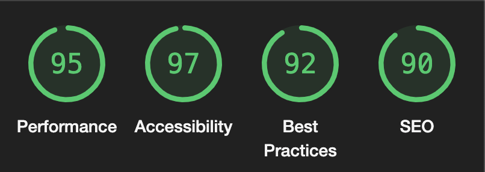

 
 

## Tools
[Google Dev Tools](https://developer.chrome.com/docs/devtools/) was used during the development process to test site responsiveness, design, and functionality.
 
 

## Browser Compatibility
Device | Outcome | Pass/Fail
--- | --- | ---
[Google Chrome](https://www.google.com/intl/en_uk/chrome/) | No appearance, responsiveness nor functionality issues. | Pass
[Firefox](https://www.mozilla.org/en-GB/firefox/)| No appearance, responsiveness nor functionality issues. | Pass
[Safari](https://safari.en.softonic.com/mac)| No appearance, responsiveness nor functionality issues. | Pass
[Edge](https://www.microsoft.com/en-us/edge)| No appearance, responsiveness nor functionality issues. | Pass

 
 

## Device Compatibility
Device | Outcome | Pass/Fail
--- | --- | ---
MacBook Pro 15" | No appearance, responsiveness nor functionality issues. | Pass
iMac 21.5"| No appearance, responsiveness nor functionality issues. | Pass
iPad Pro 10.5" | No appearance, responsiveness nor functionality issues. | Pass
iPhone 11 | No appearance, responsiveness nor functionality issues. | Pass
 
 

# Deployment
The live site can be accessed [here](https://nickwaldock.github.io/Awesome-80s/)
 
 

## GitHub
This project was deloyed to GitHub Pages with the following steps:
1. Log in to GitHub (create an account if necessary)
2. Locate the [GitHub Respository](https://github.com/NickWaldock/Awesome-80s)
3. On the repository page, find the 'Settings' icon anc click on it
4. In the Settings page, look for and click the 'Pages' menu item on the left hand side (under section titled 'Code and automation', you may need to scroll down slightly)
5. In the 'Pages' page, under 'Source', select 'Branch:main', then '/root' and click save
6. After a few minutes, the site will be published
 
 

## Forking
The fork this repository proceed with the following steps:
1. Log it to GitHub (create an account if necessary)
2. Locate the [GitHub Respository](https://github.com/NickWaldock/Awesome-80s)
3. On the repository page, find the 'Fork' menu in the top right, click on the small down arrow
4. Select '+ Create a new fork'
5. Remane repository as required
6. Click 'Create Fork'
7. You now have your forked version of this repository
 
 

## Cloning
To clone thei repository procees with the following steps:
1. Log in to GitHub (create an account if necessary)
2. Locate the [GitHub Respository](https://github.com/NickWaldock/Awesome-80s)
3. On the repository page, find and click on the 'Code' menu in the mid-top right of the page
4. Choose to either download or open in GitHub Desktop,
  -or;
    5. Choose the HTTPS option and copy the URL to your clipboard
    6. - To clone the repository using HTTPS, under "HTTPS", copy the url
       - To clone the repository using an SSH key, including a certificate issued by your organization's SSH certificate authority, click SSH, then copy the url
       - To clone a repository using GitHub CLI, click GitHub CLI, then copy url
    7. Open Terminal and change the current directory to where you want the cloned directory
    8. Type git clone, and paste the url, press Enter to create your local clone
 
 

# References & Acknoledgements

## Icons

Drum icons made by <a href="https://www.flaticon.com/authors/those-icons" title="Those Icons">Those Icons</a> from <a href="https://www.flaticon.com/" title="Flaticon">www.flaticon.com</a>

Drum icons made by <a href="https://www.freepik.com" title="Freepik">Freepik</a> from <a href="https://www.flaticon.com/" title="Flaticon">www.flaticon.com</a>

Drum icons made by <a href="https://www.flaticon.com/authors/pixel-perfect" title="Pixel perfect">Pixel perfect</a> from <a href="https://www.flaticon.com/" title="Flaticon">www.flaticon.com</a>

Icons made by <a href="https://www.flaticon.com/authors/smashingstocks" title="smashingstocks">smashingstocks</a> from <a href="https://www.flaticon.com/" title="Flaticon">www.flaticon.com</a>

For Favicon<a href="https://www.flaticon.com/free-icons/drum-kit" title="drum kit icons">Drum kit icons created by Georgy - Flaticon</a> 
 
 

## Audio
All audio samples are royalty-free and from [Samples From Mars by Splice](https://splice.com/sounds/samples-from-mars?utm_source=google&utm_medium=cpc&utm_campaign=row-en_multi_gs_ua_sounds_20211109_nonbrand-dsa_trials&utm_content=sounds&utm_term=&campaignid=15225194396&adgroupid=134877411492&adid=560294584521&gclid=CjwKCAjw6raYBhB7EiwABge5KgkUHyR75PIaEIDbgGdvhrvmnvO7wxKi_vaG05wHlBbLCLtzfrv6URoCUKQQAvD_BwE)
 
 

## References

The following sites were used for syntax checking, problem solving, and general coding concept referencing:
- [Borislav Hadzhiev](https://bobbyhadz.com/)
- [MDN] (https://developer.mozilla.org/en-US/)
- [Speaking JavaScript](http://speakingjs.com/es5/index.html#toc_ch11)
- [Stack Overflow](https://stackoverflow.com/)
- [Grepper](https://www.codegrepper.com/)
- [Green Roots Blog](https://blog.greenroots.info/)
- [The Web Dev](https://thewebdev.info/)
- [Ceos3c](https://www.ceos3c.com/)
- [Studio Slave](https://studioslave.com/tempo-bpm-to-millisecond-ms-conversion-calculator-studio-slave-tools/) For ms to BPM conversions
- [Webcode](https://webcode.tools/generators/css/keyframe-animation) For css animations
- [Solved by Flexbox](https://philipwalton.github.io/solved-by-flexbox/)
- [Flexbox](https://flexbox.malven.co/)
- [Delft Stack](https://www.delftstack.com)
- [Page Cloud](https://www.pagecloud.com/blog/how-to-add-custom-fonts-to-any-website) For importing fonts
- [background image](https://wallpaperaccess.com/80s)
- [Free Convert](https://www.freeconvert.com/) for file conversion
- [Font styling](https://gist.github.com/codingdudecom/1b219d915cfd4c2917a0be45b3cbcdda)

 
 

## Acknoledgements
My thanks and gratitude go to my project mentor Marcel for encouraging me to go beyond my capabilities and providing me with thought-provoking ideas; to the tutors at Code Institute for their assistance with my stumbling blocks

