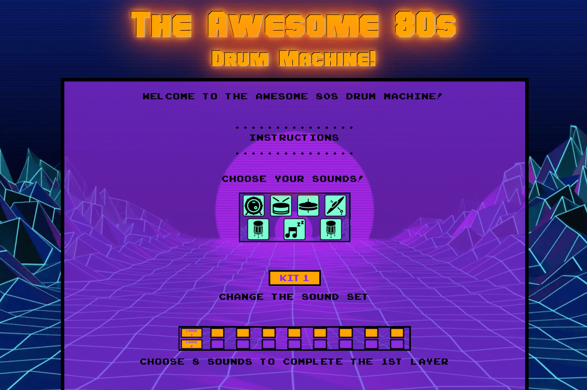

# Welcome to the Awesome 80s Drum Machine!

 

[View the live site here](https://nickwaldock.github.io/Awesome-80s/)
 
 

# Table of Contents
1. [Introduction](#introduction)
    i. [Aims](#aims)
2. [User Experience](#user-experience-ux)
    1. [User Stories](#user-stories)
3. [Main Features](#main-features)
    1. [Inspiration & Design](#inspiration--design)
    2. [Colours & Typography](#colours--typography)
    3. [Fonts](#fonts)
    4. [Wireframes](#wireframes)
    5. [Features](#features)
    6. [User Interactivity](#user-interactivity)
    7. [Future Developments](#future-developments)
4. [Technologies](#technologies)
5. [Testing](#testing)
    1. [Manual Testing](#manual-testing)
    2. [Code Validation](#code-validation)
    3. [Lighthouse Score](#lighthouse-score)
    4. [Tools](#tools)
    5. [Browser Compatibility](#browser-compatibility)
    6. [Device Compatibility](#device-compatibility)
6. [Deployment](#deployment)
    1. [GitHub](#github)
    2. [Forking](#forking)
    3. [Cloning](#cloning)
7. [References & Acknowledgements](#references--acknowledgements)
   1. [Icons](#icons)
   2. [Audio](#audio)
   3. [References](#references)
   4. [Acknoledgements](#acknoledgements)
 
 

# Introduction & Aims
The 'Awesome 80s Drum Machine!' is an 80s inspired interactive music making platorm. This site is a fun and engaging throwback to the music of the 80s and the sounds that defined a generation of music. 
This site was created to utilise the language of JavaScript and demonstrate user interactivity in a musical context. During this site the user is able to mix and match numerous drum sounds to create unique drum grooves at different speeds. This project represents my second major project with Code Institute.
 
 
This site is for educational and entertainment purposes only.

## Aims
- To create a site with a HTML structure, CSS styling, and JavaScript interactivity
- To utilise functional and simple design concepts for an easy-to-navigate UX
- Responsive design for accessability on all devices
- Incorporate audio manipulation in an interactive context
- Be visually striking
- Simple to follow instructions
- Be fun and engaging!
 
 

# User Experience
## User Stories
### As a first time visitor, I want to:
- Be able to easily comprehend the instructions for the game, know how to interact with the site and easily find the interactive elements
- Be able to view the instructions again after commencing the game if required
- Be able to change the speed of the playback
- Be able to change the sounds
- Be able to reset and create different combinations
 
 

### As a returning visitor, I want to:
- Be able to explore the range of sounds and combinations of user choices
- Enjoy making music!
- Be able to play the game on different devices
 
 
 

# Main Features
## Inspiration & Design
The site was inspired by the western pop culture of the 1980s and contains features of the decade such as early arcade style typograpy, bright neon contrasting colors, bold and simple layouts and borders, and a retro-futuristic background.
 
 

## Colours & Typography

 
 

The colours used in this project include standard Orange (#ffa500) for the button backgrounds and title text, Aquamarine (#7fffd3) for the drum trigger backgrounds, Blue Violet (#892be2) for div backgrounds, and black (#000000) for borders and arcade text. These choices were inspired by the 80s style design and add the bright, contrasting 'pop' typical of designs from the decade.
 
 

## Fonts
### Main Title Font
The font [Hauser]((https://www.dafont.com/hauser.font)) was chosen as an 80s style title font typical of arcade games and poster images of the era.
 
 

### Arcade Font
The font [Arcade](https://www.dafont.com/arcade-classic-2.font) font was chosen as an 80s style text font typical of arcade games of the era and to add to the sense of a digital retro experience.
 
 

## Wireframes
[Balsamiq](https://balsamiq.cloud/) has been used to develop wireframes to demonstrate the basic design of the site.
 
 

 
 

## Features

 

- An introductory screen with consise and easy to follow instructions on how the game works
- A 'Let's Go!' button to transition to the game area

 

 
 

- 4 distinct areas for the game elements: The clickable icons, layer indicators, control buttons, and a button to return to the instructions page
- Large icons as clickable elements that play the associated sounds on click
-  Layer indicatiors that light up and visually show the number of choices made (to a max of 8 in each row) when a user input is chosen.
- Control buttons: 
    - Kit - to change the sound set; 
    - BPM - to chose the speed to playback
    - Reset - to reset the users choices
    - Play! - to play the chosen samples
 
 

## User Interactivity
### 'Let's Go!' Button

 

The "let's Go!" button is the first interactive element on the page and is available at the bottom of the instructions that show on page load. The intention is that the user will need to read the instructions to understand the basic mechanics of the site before beginning. CLicking this button transitions the user to the main game area.
 
 

### Drum Triggers

 

The user then sees the above icons at the top of the page which represent the different sound 'tiggers'. Hovering the mouse over these icons will change the arrow pointer to a hand pointer and engage a hover background gradient effect.
 

 

Clicking one of these representational icons will play the audio sample attached to it once and simultaneously add that sound to the machine's memory. Each icon contains a different drum kit sound: (from top left to right)Bass Drum, Snare Drum, Hi-Hats, Crash Cymbal, (botton left to right) Tom 1, Rest, and Tom 2. The rest symbol allows the user to program silence into their rhythm and is included to give the user a more musical experience.
 
 

### Layer Indicators

 

*Both Layers Empty*
 

Below the drum trigger icons the user will see two rows of squares called "Layer 1" and "Layer 2". These represent the programmed sounds generated from the users input (from clicking the drum trigger icons). With each sound selection one square will change color to indicate it has been saved. Sounds are saved in the order they are clicked. Once the user has selected 8 sounds the second layer is automatically filled. 

 

*Layer 1 Filled, Layer 2 Empty*
 

 

*Both Layers Full*
 

Each layer has a maximum size of 8 sounds to correspond with the 4, 8 (16, 32, etc) division of beats usually found in popular music. Once both layers are filled with 8 sounds the user can still click to hear the sounds individually but they will not be saved.
 
 

### Kit Selector

 

The "Kit" button switches between one set of drum sounds to another contrasting set of drum sounds. By default the button states "Kit 1" indicating that the default sound set is loaded. On clicking of this button the value changes to "Kit 2" and indicated that the second sound set is loaded. When the user then chooses sounds from the drum icons they will hear the alternative sound set. These sounds can and will be loaded into the machine when clicked and can be mixed with the sounds from Kit 1 in the same sequence meaning the user has access to program 12 individual drumkit sounds (and a rest for silence) within 16 beats can generate 30,421,755 possible permeutations *according to [Maths is Fun](https://www.mathsisfun.com/combinatorics/combinations-permutations-calculator.html).*
 
 

### BPM Input

 

The "BPM" input box is available for the user to input a speed (Beats Per Minute) into the machine thereby choosing how fast the selected sounds will play back. The speed is inuptted as a BPM integer and converted to milliseconds in JavaScript for the computer to comprehend. If a BPM isn't inputted before playing then an alert will appear to remind the user to select a speed for playback.
- *note: if the user chooses a slow BPM speed (< 80bpm) the user may notice a small delay from clicking the "Play" button and the sound commencing, this is due to the speed interval between sounds existing at the start of the loop before the sound is played. This is an attribute of JavaScript's setTimeout funciton. The effect is less noticable at faster speeds and is noted for development*
 
 

### Reset Button

 

The "Reset" button allows the user to clear (delete) both layers of any previously programmed sound allowing space to generate a new pattern of sounds for playback. 
 
 

### Play Button

 

The "Play!" button commences playback of the pre-loaded sounds. Attempting to start playback without completing the 2 layers will result in an alert to the user to input more sounds.
 
 

### View Instructions

 

Finally, a "Show Instructions" button allows the user to switch back to the main instructions screen once again if they require refreshing of the controls and functions. Returning to the game area after this will maintain all of their previously chosen sounds and speeds (if any were chosen).
 
 

## Future Developments
This project has a great deal of developmental potential in features that could eventually add increased functionality and a deeper user experiece. 
The following are a few examples:
- Main Volume control - for the user to quickly and easily control output volume
- Loop function - for the user to be able to play the loop continuously and stop the audio at will
- Additional drum sound sets - An "8-Bit Mode" utilising original 8-bit arcade and console style sounds
- Export sounds - the ability for the user to download their loop as an audio file
- Additional 80s instruments - synthesizers, bass, keyboards, guitars
- Additional programmable layers
- Bounce audio - merge multiple layers so new layers can be added on top of the merged sound. This would be most effective with the use of other instruments to create a virtual 'band' 
- Play-a-long feature - pre-loaded song audio (minus drums) to 'jam' along with
- Keyboard input function
- Have the loop commence from the first sound and not the inputted bpm interval for a smoother and more responsive experience
- Additional design elements: Button animations and transitions between elements. 
 
 

# Technologies
Languages used in this site are [HTML5](https://en.wikipedia.org/wiki/HTML5), [CSS3](https://en.wikipedia.org/wiki/CSS#CSS_3) and [JavaScript](https://en.wikipedia.org/wiki/JavaScript).

Additional technologies include: 
- [Howler](https://howlerjs.com/) 
    - Audio library manipulation
- [EZ Gif](https://ezgif.com/) 
   - Image file-type modification to webp
- [TinyPNG](https://tinypng.com/) 
   - Image compression
- [Web Code Tools](https://webcode.tools/) 
    - CSS animation and effects generator
- [Chrome DevTools](https://developer.chrome.com/docs/devtools/)
   - Debugging and testing responsiveness during development
- [JSHint](https://jshint.com/)
    - Code checking and debugging
- [Logic Pro X](https://www.apple.com/uk/logic-pro/)
    - Audio sample editing
- [GitHub](https://github.com/)
  - Site repository
- [Gitpod](https://gitpod.io/)
  - Online IDE for all coding work and site file management, terminal was used to add, commit, and push to Github
 
 

# Testing
## Manual Testing 
The following is a feature by feature explanation of the manual testing procedure detailing the expected design outcome, any bugs or code changes during development and whether the feature passes or fails the design expectation
 

### "Let's Go" Button
**User and Design Expectation**
- The button is clearly named and designed for its purpose
- This button is designed to hide the original instructions information and background and be replaced with the game area
 

**Testing** 
 - The button acts as intended. On click the instructions dissapear and the game area zooms into view. This is achieved by JavaScript adding and removing classes with using the 'display' property
  

**Result:** *Pass - the user and design expecations are fulfilled*
 
 

### Drum Triggers
**User and Design Expectation**
- Each individual icon trigger plays an individual sound back to the user and inputs that choice into an array (layer)
- It should be clear to the user which icon represents which type of drum sound through iconography and visuals
 

**Testing** 
- On testing it was decided that visual elements would need to give visual feedback to the user that the icon has been clicked, hover and a 'glow' effect were added as well as making the icons the largest visual elements on the page
- Icons were carefully chosen and placed upon a contrasting backround to represent the various types of sounds of a typical drum kit and to represent silence for the 'Rest'
- On initial testing an issue became immediately apparent: When clicked, the sample would play but could only be triggered again when the sample had finished playing. The user can easily click faster than the time it takes for the sample to finish (around 1 second). Code was incorporated into the functions to reset the sound on each click: 'currentTime = 0'. This allows the user to play the sounds as quickly as they can click making for a better user experience
- When the sounds are clicked they are automatically inputted into an array
- The 'Rest' was originally an undefined object but testing showed that although the Rest was inputted into the arrays, during playback the it could not be heard to be creating space between sounds. This was solved by uploading and attaching a wav file of silence that is the same length as the regular samples
- Vanilla HTML audio elements were originally used in the code. This functioned initially but became troublesome during development for the sounds to be played on top of each other, quickly, or in otherwise with more enthusiastic user input. Research led to finding the [Howler](https://howlerjs.com/) audio library as commonly used for such applications and was installed into this project allowing the audio to better act as intended
 

**Result:** *Pass - the user and design expecations are fulfilled*
 
 

### Kit Selector
**User and Design Expectation**
- To indicate to the user which of the two drum kit sound sets is currently active
- Be interactive on mouse hover to indicate a clickable element and provide visual feedback that a click has occured
- Have a visual indication that the button has been clicked

**Testing**
- The user clicks the button which activates the 'active' (a 'pop' effect) and 'hover' (a continuous fade in and out effect) CSS classes and the inner text changes and alternates from "Kit 1" to "Kit 2"
- For the user to be able to switch sound sets during the layer programming a hidden check box was used to toggle between the sounds via JavaScript 'if' statements in the individual sound functions.

**Result:** *Pass - the user and design expecations are fulfilled*
 
 

### BPM Input
**User and Design Expectation**
- The button is clearly named and designed for its purpose
- To allow the user to input their choice of speed in beats per minute and for the computer to interpret the choice correctly during audio playback performance
- For the input to be an integer only 
 

**Testing**
- The first solution theorised used radio buttons with a selection of pre-set tempos for the user to choose between, although possible this wouldn't allow the user as much freedom to manipulate the tempos to extremes or with nuance as an input integer input would.
- The input was set to specifically accept integers and update a variable for the setTimeout function
- In testing the user input would automatically be interpreted in milliseconds. Code was required to convert beats per minutes into milliseconds as the value is loaded into the variable
 

**Result:** *Pass - the user and design expecations are fulfilled*
 
 

### Reset Button
**User and Design Expectation**
- The button is clearly named and designed for its purpose
- Be interactive on mouse hover to indicate a clickable element and provide visual feedback that a click has occured
- The button resets the loaded sounds allowing the user to create sound patterns from scratch
- Provide visual feedback to the user that the reset has been succesful
 

**Testing**
- The user clicks the button which activates the 'active' (a 'pop' effect) and 'hover' (a continuous fade in and out effect) CSS classes
- The arrays generated in JavaScript will be emptyied and counters reset to '0' 
- The layer indicator squares revert to their default state by removing the overiding 'orange' class
 

**Result:** *Pass - the user and design expecations are fulfilled*
 
 

### Play Button
**User and Design Expectation**
- The button is clearly named and designed for its purpose
- Executes the functions to begin playback of both pre-programmed layers simultaneously
- Only executes if a BPM is inputted
- Only executes if the both layers are fully programmed
- Performs the programmed selection once and the specified speed and in the order programmed by the user
 

**Testing**
- The button is placed on the far right of the control panel to help distinguish that it is the last step in the chain of actions
- On click an alert occurs when the "if" condition of 'BPM user input = false', alert prompts the user to input a number
- On click an alert occurs when the "if" condition of 'layers 1 & 2 fully programmed = false', alert prompts the user to choose more sounds
- On click the functions for playLayer1 and playLayer2 run simultaneously. These functions include the timeout variable and the conditional statements for execution
- An issue occurs if the audio has played once if clicked a second or third time the function would not playback the audio. This bug was solved by setting these two playLayer1 and playLayer2 functions within a parent function called 'playLayers', which resets the array index number to zero on each click. This allows the function to begin playback of the audio from the start of the array each time the 'Play!' button is activated. For coding simplicity and logic, the conditional statements for BPM and full layers were moved inside this parent function as well

**Result:** *Pass - the user and design expecations are fulfilled*
 
 

### Layer Indicators
**User and Design Expectation**
- Act as a visual cue to the user indicating how many sounds have been selected and are left remaining to be selected in each layer
- Be designed in keeping with an 80s arcade theme
- A single square lights up with each individual click of a drum trigger
- Once all 8 squares in layer 1 are filled the layer 2 square will begin to fill
- The lit squares should accurately represent the size of the programmed layers at all times
 

**Testing**
- The original design was to incorporate single changing integer that represented the number of sounds currently programmed. Early on it was then decided that could be visually represented as blocks to help minimise excess text information and be similar to that of a data 'loading' screen, thereby keeping with the arcade theme
- On the click of a sound trigger the left-hand most square of layer 1 will turn from purple to orange indicating a sound has been chosen and loaded into the array. Subsequent clicks change the background colour from purple to orange sequentially from left to right until the 1st layer is complete
- On the 9th drum trigger click the left most square of the 2nd layer will turn from purple to orange and subsequent clicks will repeat the pattern of representational change as in layer 1
- On testing it was required to create conditional statements to control the size of the programmes layers (arrays), once both layers are full and all indicator squares are orange or 'lit up' the user can continue to experiment with sounds but can clearly see the layers are full until they are reset
 

**Result** *Pass - the user and design expecations are fulfilled*
 
 

### View Instructions
**User and Design Expectation**
- The button is clearly named and designed for its purpose
- Allows the user to view the instructions if so desired
- Hides the game area for clear viewing of the instructional content
- Doesn't reset the game when the user returns to the game area
 

**Testing**
- The first iteration of this button was styled differently to the control panel buttons. This was later adapted to be more congruent with the styling of the other buttons for a more pleasing aesthetic
- The entire div was clickable as the button in this first iteration, with the style change this feature became incongruent. The code was adapted for only the button to be clickable, but large enough to be a clear and easy area to click if required
- The button uses JavaScript to hide the game and control areas and show the instructions as if entering the site for the first time. This provides familiarity for the user as there are only two possible pages to view.
 

**Result** *Pass - the user and design expecations are fulfilled*
 

### Responsiveness
**User and Design Expectation**
- To be able to play the game on any device and screen size
- For the site to maintain is core structural design in different screen sizes
 

**Testing**
- Responsiveness was achieved primarialy through the use of grid to arrange the main parent elements and flexbox to arrange content within the grid. Chrome Dev Tools was the primary tool for testing responsiveness throughout development
- CSS Media Queries were incorporated to adjust the grid and flex attributes for smaller screens where issues of text size or buttons became too small to be viewed easily. Minimum sizes for buttons and small margins to keep elements seperated were also utilised.
- Responsiveness was additionally tested in Safari, Firefox, and Edge browers, and using [Am I Responsive](https://ui.dev/amiresponsive) and the [Responsive Design Checker](https://www.responsivedesignchecker.com/)
- The site design responsiveness is effective down to 320px view width
 

**Result** *Pass - the user and design expecations are fulfilled - Although additional testing on non-apple devices would be prudent*
 
 

## Code Validation
This site has been passed successfully through the following code validation sites with no errors or issues:
- [W3C HTML Validator Results](https://validator.w3.org/nu/?doc=https%3A%2F%2Fnickwaldock.github.io%2FAwesome-80s%2F)
 
 

- [W3C CSS Validator Results](https://jigsaw.w3.org/css-validator/validator?uri=https%3A%2F%2Fnickwaldock.github.io%2FAwesome-80s%2F&profile=css3svg&usermedium=all&warning=1&vextwarning=&lang=en)
 
 

- [JSHint Java Script Code Quality Tool](https://jshint.com/)
- [Responsive Design Checker](https://www.responsivedesignchecker.com/)
 
 

## Lighthouse Score
[Google Dev Tools Lighthouse](https://chrome.google.com/webstore/detail/lighthouse/blipmdconlkpinefehnmjammfjpmpbjk?hl=en) tool was used to check site performance.
 

 
 

## Tools
[Google Dev Tools](https://developer.chrome.com/docs/devtools/) was used during the development process to test site responsiveness, design, and functionality.
 
 

## Browser Compatibility
Device | Outcome | Pass/Fail
--- | --- | ---
[Google Chrome](https://www.google.com/intl/en_uk/chrome/) | No appearance, responsiveness nor functionality issues.* | Pass
[Firefox](https://www.mozilla.org/en-GB/firefox/)| No appearance, responsiveness nor functionality issues. | Pass
[Safari](https://safari.en.softonic.com/mac)| No appearance, responsiveness nor functionality issues. | Pass
[Edge](https://www.microsoft.com/en-us/edge)| No appearance, responsiveness nor functionality issues. | Pass

* *Bug - The only issue for chrome is the audio library conflicting with [Google's Audio Auto Play Policy](https://developer.chrome.com/blog/autoplay/#webaudio), however the site has no audio that can potentially auto-play. This warning is due to the use of the [Howler](https://howlerjs.com/) audio library*

 
 

## Device Compatibility
Device | Outcome | Pass/Fail
--- | --- | ---
MacBook Pro 15" | No appearance, responsiveness nor functionality issues | Pass
iMac 21.5"| No appearance, responsiveness nor functionality issues | Pass
iPad Pro 10.5" | No appearance, responsiveness nor functionality issues | Pass
iPhone 11 | No appearance, responsiveness nor functionality issues | Pass
 
 

# Deployment
The live site can be accessed [here](https://nickwaldock.github.io/Awesome-80s/)
 
 

## GitHub
This project was deloyed to GitHub Pages with the following steps:
1. Log in to GitHub (create an account if necessary)
2. Locate the [GitHub Respository](https://github.com/NickWaldock/Awesome-80s)
3. On the repository page, find the 'Settings' icon anc click on it
4. In the Settings page, look for and click the 'Pages' menu item on the left hand side (under section titled 'Code and automation', you may need to scroll down slightly)
5. In the 'Pages' page, under 'Source', select 'Branch:main', then '/root' and click save
6. After a few minutes, the site will be published
 
 

## Forking
The fork this repository proceed with the following steps:
1. Log it to GitHub (create an account if necessary)
2. Locate the [GitHub Respository](https://github.com/NickWaldock/Awesome-80s)
3. On the repository page, find the 'Fork' menu in the top right, click on the small down arrow
4. Select '+ Create a new fork'
5. Remane repository as required
6. Click 'Create Fork'
7. You now have your forked version of this repository
 
 

## Cloning
To clone thei repository procees with the following steps:
1. Log in to GitHub (create an account if necessary)
2. Locate the [GitHub Respository](https://github.com/NickWaldock/Awesome-80s)
3. On the repository page, find and click on the 'Code' menu in the mid-top right of the page
4. Choose to either download or open in GitHub Desktop,
  - or;
    5. Choose the HTTPS option and copy the URL to your clipboard
    6. - To clone the repository using HTTPS, under "HTTPS", copy the url
       - To clone the repository using an SSH key, including a certificate issued by your organization's SSH certificate authority, click SSH, then copy the url
       - To clone a repository using GitHub CLI, click GitHub CLI, then copy url
    7. Open Terminal and change the current directory to where you want the cloned directory
    8. Type git clone, and paste the url, press Enter to create your local clone
 
 

# References & Acknoledgements

## Icons

Drum icons made by <a href="https://www.flaticon.com/authors/those-icons" title="Those Icons">Those Icons</a> from <a href="https://www.flaticon.com/" title="Flaticon">www.flaticon.com</a>

Drum icons made by <a href="https://www.freepik.com" title="Freepik">Freepik</a> from <a href="https://www.flaticon.com/" title="Flaticon">www.flaticon.com</a>

Drum icons made by <a href="https://www.flaticon.com/authors/pixel-perfect" title="Pixel perfect">Pixel perfect</a> from <a href="https://www.flaticon.com/" title="Flaticon">www.flaticon.com</a>

Icons made by <a href="https://www.flaticon.com/authors/smashingstocks" title="smashingstocks">smashingstocks</a> from <a href="https://www.flaticon.com/" title="Flaticon">www.flaticon.com</a>

For Favicon<a href="https://www.flaticon.com/free-icons/drum-kit" title="drum kit icons">Drum kit icons created by Georgy - Flaticon</a> 
 
 

## Audio
All audio samples are royalty-free and from [Samples From Mars by Splice](https://splice.com/sounds/samples-from-mars?utm_source=google&utm_medium=cpc&utm_campaign=row-en_multi_gs_ua_sounds_20211109_nonbrand-dsa_trials&utm_content=sounds&utm_term=&campaignid=15225194396&adgroupid=134877411492&adid=560294584521&gclid=CjwKCAjw6raYBhB7EiwABge5KgkUHyR75PIaEIDbgGdvhrvmnvO7wxKi_vaG05wHlBbLCLtzfrv6URoCUKQQAvD_BwE)
 
 

## References

The following sites were used for syntax checking, problem solving, and general coding concept referencing:
- [Borislav Hadzhiev](https://bobbyhadz.com/)
- [MDN] (https://developer.mozilla.org/en-US/)
- [Speaking JavaScript](http://speakingjs.com/es5/index.html#toc_ch11)
- [Stack Overflow](https://stackoverflow.com/)
- [Grepper](https://www.codegrepper.com/)
- [Green Roots Blog](https://blog.greenroots.info/)
- [The Web Dev](https://thewebdev.info/)
- [Ceos3c](https://www.ceos3c.com/)
- [Studio Slave](https://studioslave.com/tempo-bpm-to-millisecond-ms-conversion-calculator-studio-slave-tools/) For ms to BPM conversions
- [Webcode](https://webcode.tools/generators/css/keyframe-animation) For css animations
- [Solved by Flexbox](https://philipwalton.github.io/solved-by-flexbox/)
- [Flexbox](https://flexbox.malven.co/)
- [Delft Stack](https://www.delftstack.com)
- [Page Cloud](https://www.pagecloud.com/blog/how-to-add-custom-fonts-to-any-website) For importing fonts
- [background image](https://wallpaperaccess.com/80s)
- [Free Convert](https://www.freeconvert.com/) for file conversion
- [Font styling](https://gist.github.com/codingdudecom/1b219d915cfd4c2917a0be45b3cbcdda)
- [Responsive Design Checker](https://www.responsivedesignchecker.com/)

 
 

## Acknoledgements
My thanks and gratitude go to my project mentor Marcel for encouraging me to go beyond my capabilities, providing me with thought-provoking ideas to solve the problems faced by this project. Also, to the tutors at Code Institute for their patience and guidance in their generous assistance with my learning and developing JavaScript skills.

